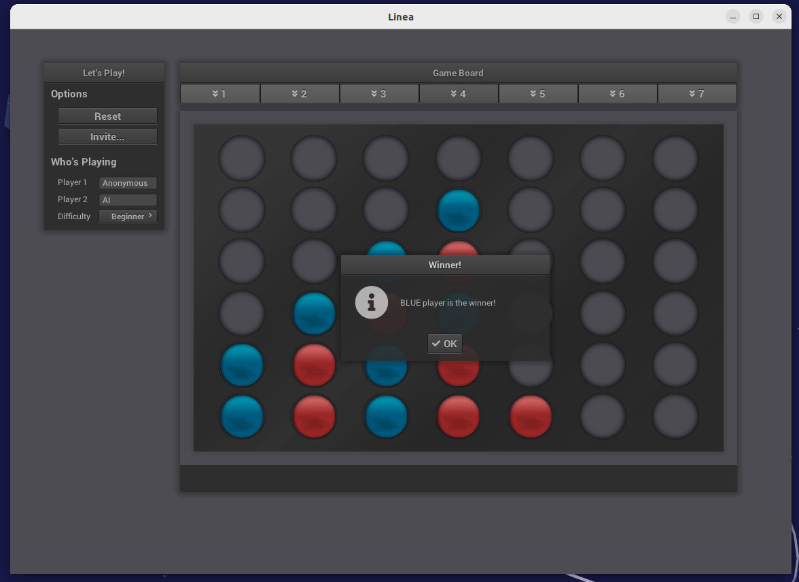

# orianna

> Connect-four, five, and fun variations with AI and network multiplayer support 🎲



## Features

...


## Development

**Note**: You will need at least gcc/g++10, python3.4, and cmake 3.14.

* Install submodules

> `git submodule update --init --recursive`

* Install dependencies (debian/ubuntu)

> `sudo apt-get install libx11-dev xorg-dev doctest-dev libglu1-mesa-dev python-dev python3-dev`


### Building

Build by making a build directory (i.e. `build/`), run `cmake` in that dir, and then use `make` to build the desired target.

Example:

``` bash
> mkdir build && cd build
> cmake .. -DCMAKE_BUILD_TYPE=[Debug | Coverage | Release]
> make
> ./main
> make test      # Makes and runs the tests.
```

**Note**: Copy the root `resources` folder to the directory of the built binary

---

:format(webp):no_upscale()/cdn.vox-cdn.com/uploads/chorus_asset/file/13264983/DpZaNreW4AAkjwO.jpg)