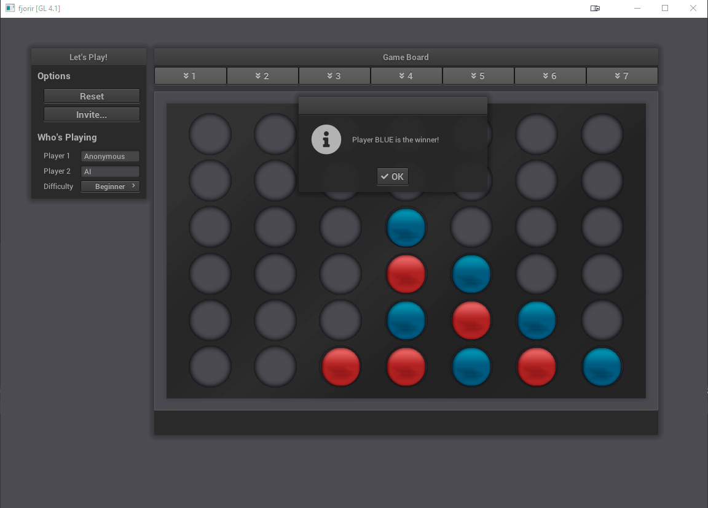

# línea

> Connect-four, five, and fun variations with AI and network multiplayer support 🎲



## Features

...


## Building

Build by making a build directory (i.e. `build/`), run `cmake` in that dir, and then use `make` to build the desired target.

Example:

``` bash
> mkdir build && cd build
> cmake .. -DCMAKE_BUILD_TYPE=[Debug | Coverage | Release]
> make
> ./main
> make test      # Makes and runs the tests.
```


## Tests